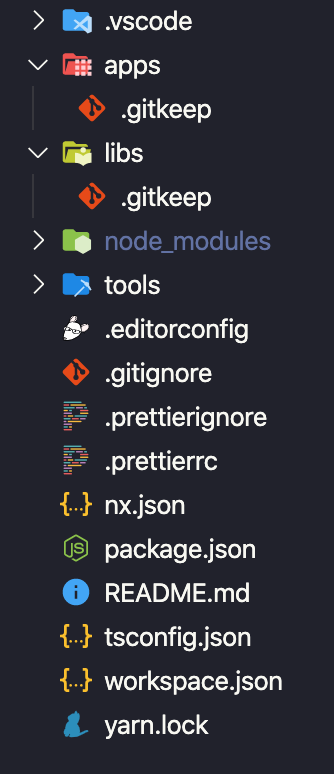

# 💻 Lab 1 - generate an empty workspace

###### ⏰ Estimated time: 5-10 minutes
 

## 📚 Learning outcomes:

- **Understand how to bootstrap a new Nx workspace**
   

## 📲 After this workshop, your app should look similar to this:

  
File structure

  

  

## 🏋️‍♀️ Steps :

1. **Generate an empty Nx workspace** for a fictional company called "The Board Game Hoard"
      
2. **The workspace name should be `bg-hoard`.** Make sure you select `Empty` workspace and `No to NxCloud` when asked
      

---

🎓If you get stuck, check out [the solution](SOLUTION.md)

---

[➡️ Next lab ➡️](../lab2/LAB.md)
