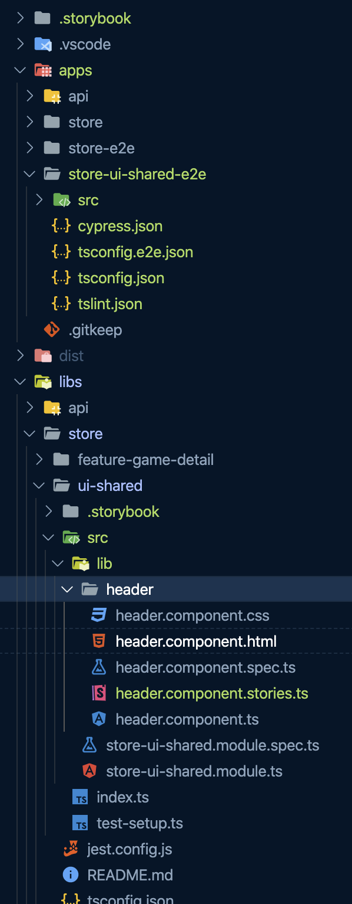
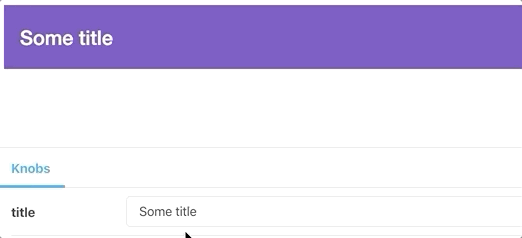

### 💻 Lab 10 - Generate Storybook stories for the shared ui component

###### ⏰ Estimated time: 10-15 minutes

Let's explore some more Nx plugins by generating and running a storybook configuration for our shared store header.

#### 📚 Learning outcomes:

- Explore other Nx plugins to create a storybook configuration

#### 📲 After this workshop, you should have:

<details>
  <summary>App Screenshot</summary>
  No change in how the app looks!
</details>

<details>
  <summary>File structure</summary>
  
</details>

#### 🏋️‍♀️ Steps:

1. `yarn add @nrwl/storybook`
2. Use the `nrwl/angular:storybook-configuration` schematic to generate a storybook configuration for the `store-ui-shared` project

   ⚠️ Answer **YES** to all questions

3. Inside `libs/store/ui-shared/src/lib/header/header.component.stories.ts`:

   - Import the `MaterialToolbarModule`
   - Import the Angular Material Theme

   <details>
   <summary>🐳 Hint</summary>

   ```ts
   //IMPORT TOOLBAR MODULE
   import { MatToolbarModule } from '@angular/material/toolbar';

   //IMPORT THEME
   import '@angular/material/prebuilt-themes/deeppurple-amber.css';

   //......

   export const primary = () => ({
     moduleMetadata: {
       imports: [MatToolbarModule] // <-- import the module
     }
     //...
   });
   ```

   </details>

4. Serve storybook!

   ⚠️ If you get an error, try running `yarn` again, and when asked, select the top version from `babel/core`

   <details>
   <summary>🐳 Hint</summary>

   `nx storybook store-ui-shared`

   </details>

5. start typing in different titles and see how they appear in the header

   

6. Inspect what changed from the last time you committed, then commit your changes

---

🎓If you get stuck, check out [the solution](SOLUTION.md)

---

[➡️ Next lab ➡️](../lab11%20-%20bonus/LAB.md)
