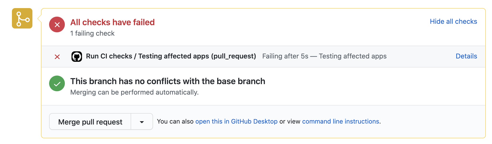
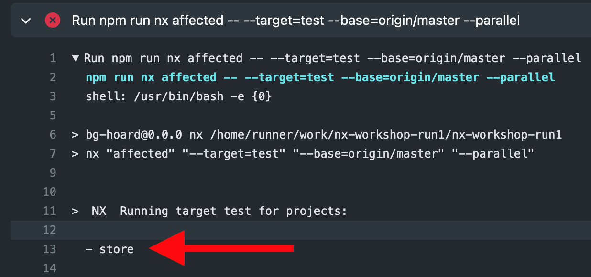
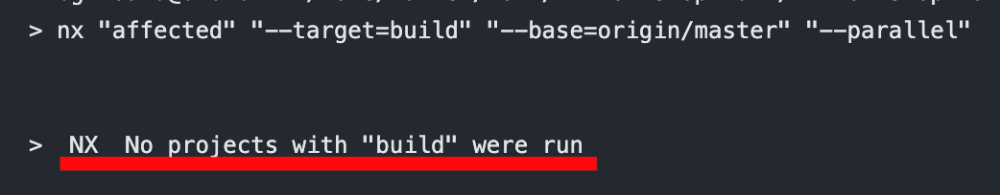

# 💎 Lab 15 - Setting up CI

###### ⏰ Estimated time: 5-10 minutes
<br />

## 📚 Learning outcomes:

- Basics of GitHub actions
- Use Nx to setup scalable checks on your PRs to ensure only passing code goes into master
- Explore other practical uses of `nx affected`

## 🏋️‍♀️ Steps :

Before starting on this lab, it's important that you have a version of your local workshop
pushed to your GitHub repo. 

1. Let's make sure the master branch is up to date (it's important your latest changes are on `master` for the follow-up steps):
    - If you already are on `master` - commit everything:
        ```
        git add . && git commit -m "finished lab 14"
        git push origin master
        ```

    - If you are on a different branch, commit everything, switch to master
and bring it up to date:

        ```
        git add . && git commit "finish lab 14"
        git checkout master
        git merge previous-branch-you-were-on
        git push origin master
        ```
   <br />

2. Create a new file `.github/workflows/ci.yml`

    ```yml
    name: Run CI checks # The name will show up on the GitHub Actions dashboard
    
    on: [pull_request] # This workflow will run only on Pull Requests
    
    jobs:
      test-store: # give our job an ID
        runs-on: ubuntu-latest # the image our job will run on
        name: Test Store # the name that will appear on the Actions UI
        steps: # what steps it will perform
          - uses: actions/checkout@v1 # checkout whatever branch the PR is using
          - uses: bahmutov/npm-install@v1 # trigger an `npm install`
          - run: npm run nx test store # test the "store" project
      test-api: 
        runs-on: ubuntu-latest 
        name: Test API
        steps: 
          - uses: actions/checkout@v1
          - uses: bahmutov/npm-install@v1
          - run: npm run nx test api
      
    ```
   
   ⚠️ Make sure to remove the "helper" comments above.
   <br /> <br />

3. Commit and then switch to a new branch:

    ```
    git add . && git commit -m "add ci"
    git push origin master
    git checkout -b dynamic-title
    ```

    ⚠️ I know we **just** switched to master above. But it was important we bring it
    up to date. Now we need to switch to a new branch so we can submit our PR.
    <br /> <br />

4. Open `apps/store/src/app/app.component.html`
   <br /> <br />

5. And make the title of the header dynamic:

    ```
    <bg-hoard-header [title]="title"></bg-hoard-header>
    ```
    <br /> <br />

6. Commit all your changes and push your new branch.
   <br /> <br />
7. Go to GitHub and make a Pull Request to `master`
   <br /> <br />
8. After a few moments you'll see something like this:
    
    <br /> <br />
9. The unit tests will be failing - that's expected.
   <br /> <br />

---

We are starting to set-up our CI, that will verify our Pull Requests to ensure bad code
doesn't go into `master`.

But now we're testing both projects - even though we only changed the store.

---

### Testing only affected

10. Let's use `nx affected` to only test the changed projects:
    
    Instead of running two `nx` commands in your CI, run a single `nx affected` command
    that tests all affected projects.

    <details>
    <summary>🐳 Hint 1</summary>
    
    Check-out this [handy tutorial](https://nx.dev/latest/angular/tutorial/11-test-affected-projects#step-11-test-affected-projects)
    Refer to the [docs](https://nx.dev/latest/angular/cli/affected#affected) 
    </details>
    
    <details>
    <summary>🐳 Hint 2</summary>
    
    Since it's a Pull Request, your base commit will always be `--base=origin/master` 
    </details>

    <details>
    <summary>🐳 Hint 3</summary>

    You should only need 1 job now:
    
    ```yaml
    jobs:
      test:
        runs-on: ubuntu-latest
        name: Testing affected apps
        steps:
          - uses: actions/checkout@v1
          - uses: bahmutov/npm-install@v1.4.5
          - run: .....
    ```
    </details>

    ⚠️ It's okay to work on this on your new branch. We'll merge everything to `master`
    eventually.
    <br /> <br />

11. Commit and push. On your Github Actions log you should see only the `store` tests running:

    
    <br />

12. Our tests are now being ran sequentially for each project. See if you can run them in parallel (consult the Nx Affected [docs](https://nx.dev/latest/angular/cli/affected#affected) if unsure) 
   <br /> <br />

13. Our CI only does testing now. But we also have targets for `lint`, `e2e` and `build`. Would really be handy if CI also told us if any of those failed.

    **Add more jobs under your CI workflow that run affected for each of the above targets**
    <br /> <br />

13. Commit and push your `ci.yml` changes.
   <br /> <br />
14. You'll notice some new steps in the GitHub Actions UI. Some of them are failing. That is okay. We can fix them later.
   <br /> <br />
15. For now, you can merge your PR into `master `
   <br /> <br />
16. Switch to `master` locally and pull latest so all your new CI changes are up to date.

    ```shell
    git checkout master
    git pull origin master
    ```
    <br /> <br />

17. **BONUS:** Currently, if we create a PR with a change **only** to our `ci.yml` file, our `nx affected` commands won't run at all: as they'll think no project has been affected:

    

    To be safe, we'd like to mark all projects as affected whenever we change our CI config, as we don't know what those changes could have broken.
    Have a look through the docs in the hint and see if you can do this.

    <details>
    <summary>🐳 Hint</summary>
  
    [Configuring implicit dependencies](https://nx.dev/latest/angular/core-concepts/configuration#implicit-dependencies)
    </details>
    <br />

---

🎓If you get stuck, check out [the solution](SOLUTION.md)

---

[➡️ Next lab ➡️](../lab16/LAB.md)
