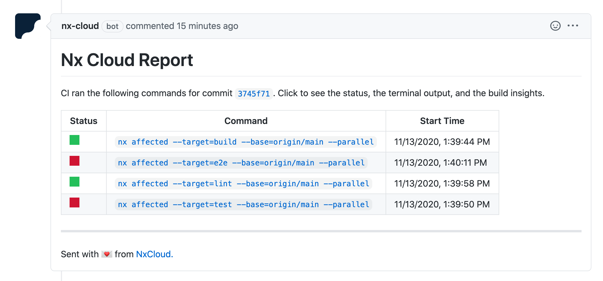
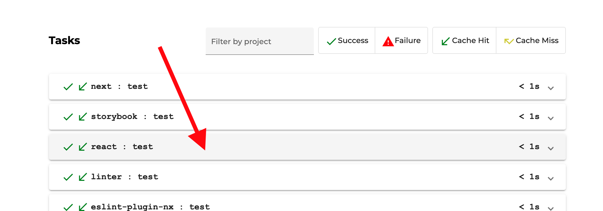
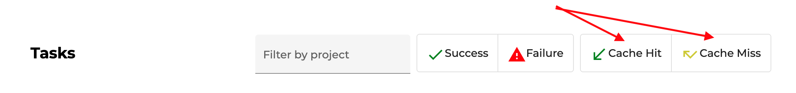

### 🔍 Lab 17 - NxCloud GitHub bot

###### ⏰ Estimated time: 10 minutes

#### 📚 Learning outcomes:

- Explore the NxCloud Run-Detail pages 
- Configure the NxCloud bot to get easy to read reports on the Nx checks performed during CI

#### 🏋️‍♀️ Steps :

1. **Enable the NxCloud GitHub bot** on your GitHub repository: [https://github.com/apps/nx-cloud](https://github.com/apps/nx-cloud)
2. Switch to a new branch
3. Add these env variables to your GitHub actions config:

    ```
    name: Run CI checks
    
    on: [pull_request]
    
    env:
      NX_BRANCH: ${{ github.event.number }}
      NX_RUN_GROUP: ${{ github.run_id }}
    
    jobs:
      build:
        ......
    ```

4. Make a change in the store: `apps/store/src/app/app.component.ts` (so that it will trigger our affected commands in CI):

    ```
    export class AppComponent {
      constructor(private http: HttpClient) {
        console.log("component constructed")
      }
    ```

5. Commit everything and push your branch
6. Make a PR on GitHub
7. Once the checks finish you should see:

    
    
8. Click on one of the "failed" commands (if any). On the "Run Details" page, click on one of the projects
and inspect the terminal output:

    
    
    🔥 Rather than reading through CI logs, you can use this view to filter to the failed projects and
    inspect the failure reason scoped to that project.
    
9. Have a look at the "Cache Hit" and "Cache Miss" filters. What do you think they do?

    
    
10. Finally, you should see a "Claim workspace" button at the top - it's a good idea to do that at this stage. We'll explain more about that in a bit!

8. Merge your PR into master and pull latest locally:

    ```
    git checkout master
    git pull
    ```

---

[➡️ Next lab ➡️](../lab18/LAB.md)
