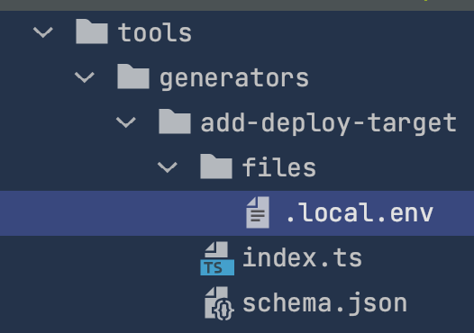

##### Generate a React app

```shell
yarn add @nrwl/react
nx g @nrwl/react:app admin-ui
nx serve admin-ui
```

##### Adding a deploy config

```shell
nx generate run-commands deploy --project=admin-ui --command="surge dist/apps/admin-ui \${SURGE_DOMAIN_ADMIN_UI} --token \${SURGE_TOKEN}"
```

##### Bonus 

```shell
nx g workspace-generator add-deploy-target 
```



`./files/.local.env`:

```
SURGE_DOMAIN_<%= undercaps(project) %>=https://<%= subdomain %>.surge.sh
```

`index.ts`:

```typescript
import {
  Tree,
  formatFiles,
  installPackagesTask,
  generateFiles,
} from '@nrwl/devkit';
import { runCommandsGenerator } from '@nrwl/workspace/generators';
import { join } from 'path';

interface Schema {
  project: string;
  subdomain: string;
}

export default async function (host: Tree, schema: Schema) {
  await runCommandsGenerator(host, {
    name: 'deploy',
    project: schema.project,
    command: `surge dist/apps/${
      schema.project
    } \${SURGE_DOMAIN_${underscoreWithCaps(
      schema.project
    )}} --token \${SURGE_TOKEN}`,
  });
  await generateFiles(
    host,
    join(__dirname, './files'),
    `apps/${schema.project}`,
    {
      tmpl: '',
      project: schema.project,
      subdomain: schema.subdomain,
      undercaps: underscoreWithCaps,
    }
  );
  await formatFiles(host);
  return () => {
    installPackagesTask(host);
  };
}

export function underscoreWithCaps(value: string): string {
  return value.replace(/-/g, '_').toLocaleUpperCase();
}
```

`schema.json`:

```json
{
  "cli": "nx",
  "id": "add-deploy-target",
  "type": "object",
  "properties": {
    "project": {
      "type": "string",
      "description": "Project name to generate the deploy target for",
      "$default": {
        "$source": "argv",
        "index": 0
      }
    },
    "subdomain": {
      "type": "string",
      "description": "Surge subdomain where you want it deployed.",
      "x-prompt": "What is the Surge subdomain you want it deployed under? (https://<your-subdomain>.surge.sh)"
    }
  },
  "required": ["project", "subdomain"]
}
```

