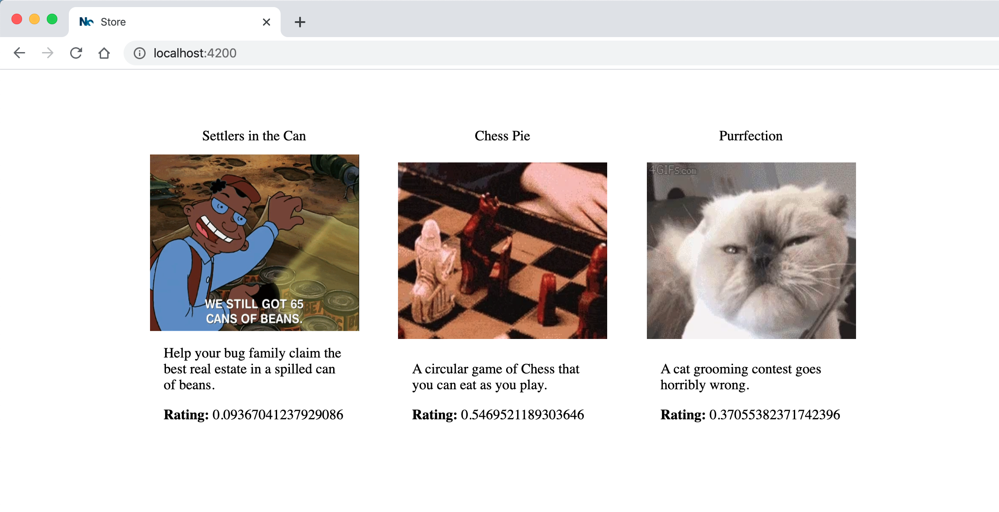
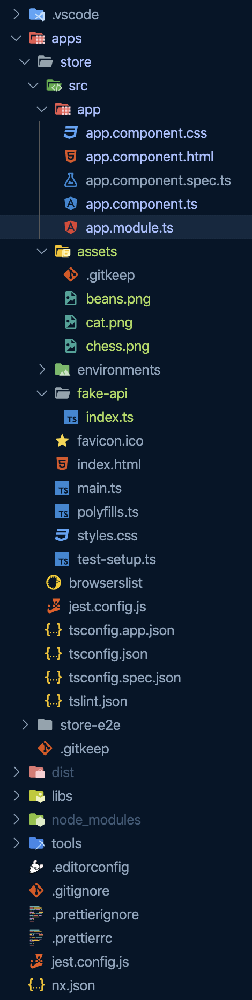
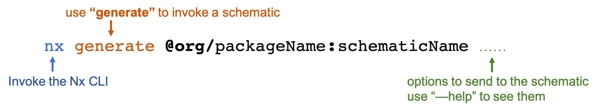

### 💻 Lab 2 - Generate an Angular app

###### ⏰ Estimated time: 15-20 minutes

> Before starting this lab, you can either clone this Git repository (`master` branch will be the starting point) or continue in the folder you created. If you clone, you will get access to all the lab branches so you can `git checkout lab-xx` if you fall behind.

In this lab we'll generate our first Angular application within the new monorepo.

#### 📚 Learning outcomes:

- Get familiar with generating new apps within your workspace using the Nx CLI

#### 📲 After this workshop, your app should look similar to this:

<details>
  <summary>App Screenshot</summary>
  
</details>

<details>
  <summary>File structure</summary>
  
</details>

#### 🏋️‍♀️ Steps:

1. Make sure you can run Nx commands:
   - try out `nx --version` and see if it outputs a version number
   - install the CLI globally: `npm i -g @nrwl/cli`
   - if you don't want to install it globally, use `yarn nx` instead of `nx` in all the commands below

> Please make sure you are using the latest version of Nx (9.1.4)

2. Run `nx list` to see which plugins you have installed
3. Add the Angular plugin: `yarn add @nrwl/angular`
4. Let's also add Angular Material so we can use some of their components: `yarn add @angular/material @angular/cdk`
5. Use the [`@nrwl/angular` plugin](https://nx.dev/angular/api/angular/schematics/application) to generate an Angular app called `store` in your new workspace

   ⚠️**Important:** Make sure you **enable routing** when asked!

   <details>
   <summary>🐳 Hint</summary>
   
   </details>

6. Create a `fake-api.ts` file in your new app that returns an array of some games (you can just copy the code from [here](../../examples/lab2/apps/store/src/fake-api/index.ts))
   ⏳**Reminder:** When you are given example files to copy, the folder they're in hints to the _folder_ and _filename_ you can place them in when you do the copying
7. Add some basic styling to your new component and display the games from the Fake API (to not spend too much time on this, you can copy it from here [.html](../../examples/lab2/apps/store/src/app/app.component.html) / [.css](../../examples/lab2/apps/store/src/app/app.component.css) / [.ts](../../examples/lab2/apps/store/src/app/app.component.ts) - and replace the full contents of the files)
8. You can get the example game images from [here](../../examples/lab2/apps/store/src/assets)

   ⚠️ Make sure you put them in the correct folder

9. Add the Material Card Module to `app.module.ts`:

   ```ts
   import { MatCardModule } from '@angular/material/card';
   ```

10. Serve the app: `nx serve store`
11. See your app live at [http://localhost:4200/](http://localhost:4200/)
12. Inspect what changed from the last time you committed, then commit your changes

---

Your app should look similar to the screenshot above!

Now we're starting to see some content! But there are some styles missing: the Angular Material theme! We'll look at how to add it in the next workshop!

The ratings also don't look that good - we'll fix those in **Lab 5**.

---

🎓If you get stuck, check out [the solution](SOLUTION.md)

---

[➡️ Next lab ➡️](../lab3/LAB.md)
