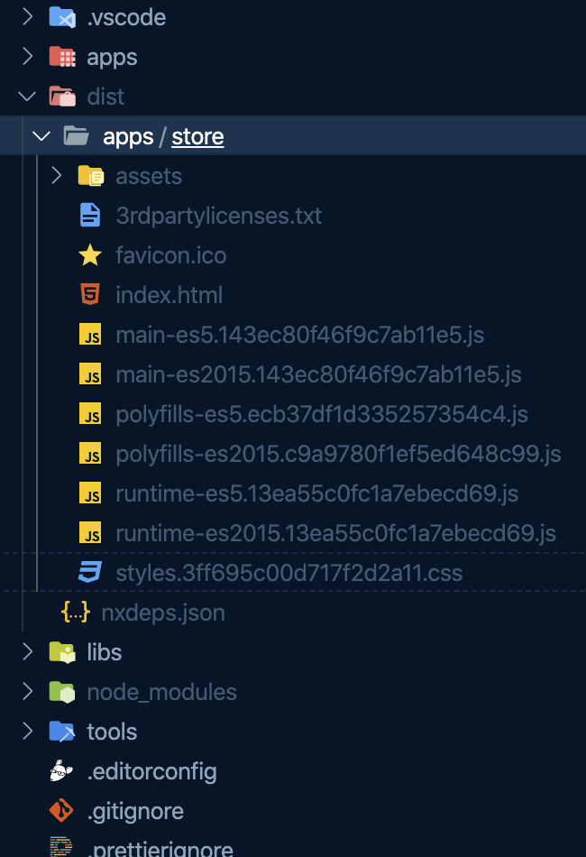

# 🚂 Lab 3.1 - Migrations

###### ⏰ Estimated time: 5-15 minutes

 

We'll learn about migration generators and use them to jump to a specific lab in the workshop.

  

## 📚 Learning outcomes:

- **Understand the `nx migrate` command**
- **Install the `@nrwl/nx-workshop` package**
- **Migrate to a specific version**
- **Modify the migrations.json file**
     

## 📲 After this workshop, you should have:

  
App Screenshot

  

  
File structure

  

## 🏋️‍♀️ Steps:

1. Install an old version of the `@nrwl/nx-workshop` npm package: `yarn add -D @nrwl/nx-workshop@0.0.1`
2. Make sure you've committed all your changes to this point: `git commit -am "lab 3"`
3. Migrate to the latest version of `@nrwl/nx-workshop`

   

   
🐳 Hint

   `nx migrate @nrwl/nx-workshop@latest`

   

    

4. Look at the `migrations.json` file. It contains the generators to complete every lab in the workshop. We don't want to run everything, so let's delete every migration entry except for labs 1 through 3.
5. The `migrations.json` file should now only contain generators for the first 3 labs. Let's run those migrations: `nx migrate --run-migrations`.
6. There's also a generator that comes with `@nrwl/nx-workshop` to help you set up the `migrations.json` file to complete a specific lab or to complete a range of labs in option 1 or option 2. Experiment with the `complete-labs` generator so that later on you can catch up if you get stuck on a lab. `nx g @nrwl/nx-workshop:complete-labs --help`

[➡️ Next lab ➡️](../lab4/LAB.md)
