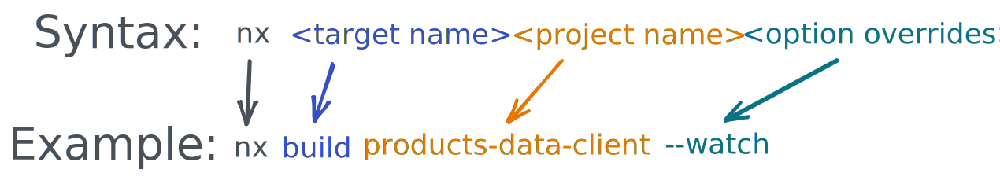

# 💻 Lab 3 - Executors

###### ⏰ Estimated time: 5-15 minutes

 

We'll build the app we just created, and look at what executors are and how to customize them.

  

## 📚 Learning outcomes:

- **Understand what a `target` and `executor` are**
- **Learn how to invoke executors**
- **Configure executors by passing them different options**
- **Understand how an executor can invoke another executor**
     

## 📲 After this workshop, you should have:

  
App Screenshot

  

  
File structure

  

## 🏋️‍♀️ Steps:

1. **Build the app**

   

   
🐳 Hint

   
   

    

2. You should now have a `dist` folder - let's **open it up**!
   - This is your whole app's output! If we wanted we could push this now to a server and it would all work.
        
3. **Open up `apps/store/project.json`** and look at the object under `targets/build`
   - this is the **target**, and it has a **executor** option, that points to `@angular-devkit/build-angular:browser`
   - Remember how we copied some images into our `/assets` folder earlier? Look through the executor options and try to find how it knows to include them in the final build!
        
4. Notice the `defaultConfiguration` executor option is pointing to `production`. This means it applies all the prod optimisations to our outputs, as per the `production` configuration in `project.json`. **Send a flag to the executor** so that it builds for development instead.

   

   
🐳 Hint

   `--configuration=development`

   

    

5. **Open up the `dist` folder** again - notice how all the file names have no hashes, and the contents themselves are human readable.
      
6. **Modify `project.json`** and instruct the executor to import the Angular Material styles: `./node_modules/@angular/material/prebuilt-themes/deeppurple-amber.css`

   

    
🐳 Hint

    
    Add it to: `"styles": ["apps/store/src/styles.css"]`
   

   🎓Notice how we can configure executors by either modifying their options in `project.json` (this step) or through the command line (step 4)!
      

7. The **serve** target (located a bit lower in `project.json`) also contains a executor, that _uses_ the output from the **build** target we just changed
   (see `serve --> options --> browserTarget` --> it points to the `build` target of the `store` project)
   - so we can just re-start `nx serve store` see the new styles you added!
        
8. **Inspect what changed** from the last time you committed, then **commit your changes**
      

---

🎓If you get stuck, check out [the solution](SOLUTION.md)

---

[➡️ Next lab ➡️](../lab3.1/LAB.md)
