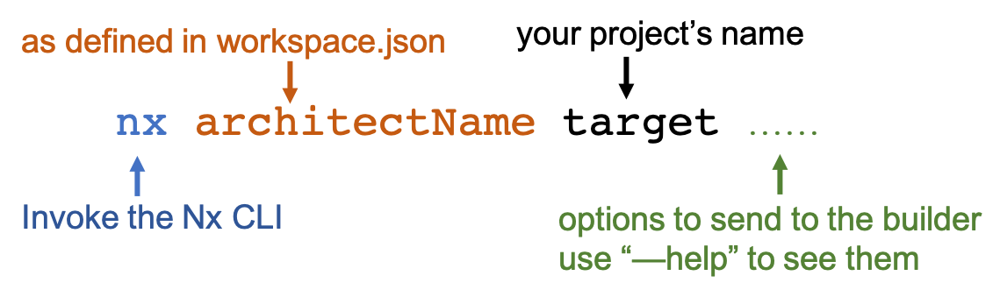

### 💻 Lab 3 - Builders

###### ⏰ Estimated time: 5-15 minutes

We'll build the app we just created, and look at what builders are and how to customize them.

#### 📚 Learning outcomes:

- Understand what an `architect` and `builder` is
- Invoking builders
- Configure builders by passing them different options
- Understand how a builder can use another builder

#### 📲 After this workshop, you should have:

  
App Screenshot

  

  
File structure

  

#### 🏋️‍♀️ Steps:

1. Build the app

   

   
🐳 Hint

   
   

2. You should now have a `dist` folder - let's open it up!
   - This is your whole app's output! If we wanted we could push this now to a server and it would all work.
3. Open up `workspace.json` and look at the object under `projects/store/architect/build`
   - this is the **architect**, and it has a **builder** option, that points to `@angular-devkit/build-angular:browser`
   - Remember how we copied some images into our `/assets` folder earlier? Look through the builder options and try to find how it knows to include them in the final build!
4. Send a flag to the builder so that it builds for production

   

   
🐳 Hint

   `--configuration=production`

   

5. Open up the `dist` folder again, it should now have no _sourcemaps_
6. Modify `workspace.json` and instruct the builder to import the Angular Material styles: `./node_modules/@angular/material/prebuilt-themes/deeppurple-amber.css` (and add it to the module's imports)

   

    
🐳 Hint

    
    Add it to: `"styles": ["apps/store/src/styles.css"]`
   

   🎓Notice how we can configure builders by either modifying their options in `workspace.json` (this step) or through the command line (step 4)!

7. The **serve** architect (located a bit lower in `workspace.json`) also contains a builder, that _uses_ the output from the **build** architect we just changed
   - so we can just re-start `nx serve store` see the new styles you added!
8. Inspect what changed from the last time you committed, then commit your changes

---

🎓If you get stuck, check out [the solution](SOLUTION.md)

---

[➡️ Next lab ➡️](../lab4/LAB.md)
