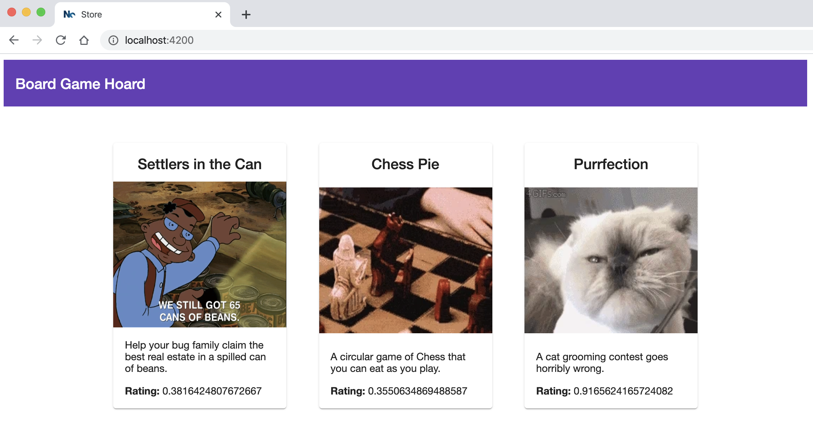
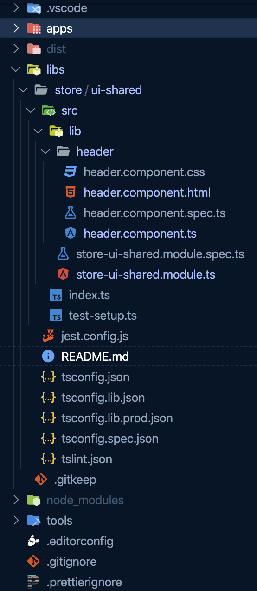

### 💻 Lab 4 - Generate a component lib

###### ⏰ Estimated time: 10 minutes

Let's add a header to our app! Because headers can be shared with other components, we will create a common lib that others can import as well.

#### 📚 Learning outcomes:

- Get familiar with generating project specific component libraries inside a folder

#### 📲 After this workshop, you should have:

<details>
  <summary>App Screenshot</summary>
  
</details>

<details>
  <summary>File structure</summary>
  
</details>

#### 🏋️‍♀️ Steps:

1. Stop the `ng serve`
2. Generate a new Angular library called `ui-shared` in the `libs/frontend` folder

   <details>
   <summary>🐳 Hint</summary>

   - it's a schematic! you've used it before in the second lab, but instead of an `app`, we now want to generate a `lib`
   - use the `--help` command to figure out how to generate it in a **directory**

   </details>

3. Generate a new Angular component, called `header`, inside the lib you just created

   ⚠️ Make sure it's **exported** from the lib's module

   <details><summary>🐳 Hint</summary>

   use `--help` to figure out how to specify under which **project** you want to generate the new component and how to automatically have it **exported**

   </details>

4. Import `MatToolbarModule` in the new shared module you just created


     <details>

   <summary>🐳 Hint</summary>

      ```ts
      import { MatToolbarModule } from '@angular/material/toolbar';

      @NgModule({
         imports: [CommonModule, MatToolbarModule],
         //...
      ```

   </details>

5. Replace the `header` component's [template](../../examples/lab4/libs/store/ui-shared/src/lib/header/header.component.html) / [class](../../examples/lab4/libs/store/ui-shared/src/lib/header/header.component.ts)

6. Import the `SharedModule` you just created in the `apps/store/src/app/app.module.ts`

   <details>
   <summary>🐳 Hint</summary>

   ```typescript
   import { StoreUiSharedModule } from '@bg-hoard/store/ui-shared';
   ```

   </details>

   ⚠️ You might need to restart the TS compiler in your editor (`CTRL+SHIFT+P` in VSCode and search for `Restart Typescript`)

7. Let's use the new shared header component we created

   - Add your new component to `apps/store/src/app/app.component.html`

    <details>
    <summary>🐳 Hint</summary>

   ```html
   <bg-hoard-header title="Board Game Hoard"></bg-hoard-header>
   <div class="container games-layout"></div>
   ```

    </details>

8. Serve the project and test the changes
9. Inspect the dependency graph - What do you see?
10. Inspect what changed from the last time you committed, then commit your changes

---

🎓If you get stuck, check out [the solution](SOLUTION.md)

---

[➡️ Next lab ➡️](../lab5/LAB.md)
