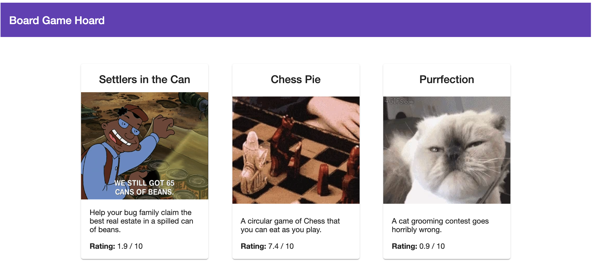
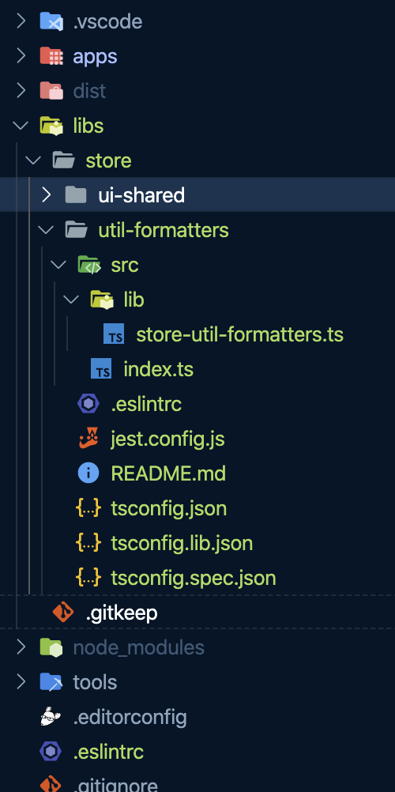

# 💻 Lab 5 - Generate a utility lib

###### ⏰ Estimated time: 5-10 minutes
<br />

Let's fix the ratings! They don't look that good and they could benefit from some formatting.

We will create a shared utility lib where we'll add our formatters and see how to import them in our components afterwards.
<br /><br />

## 📚 Learning outcomes:

- **Get familiar with generating project specific, framework agnostic utility libs**

## 📲 After this workshop, you should have:

<details>
  <summary>App Screenshot</summary>
  
</details>

<details>
  <summary>File structure</summary>
  
</details>
<br />

## 🏋️‍♀️ Steps:

1. **Stop the `nx serve`**
   <br /><br />
2. **Use the `@nrwl/workspace` package to generate another lib** in the `libs/store` folder - let's call it `util-formatters`.
   <br /><br />
3. **Add the [code for the utility function](../../examples/lab5/libs/store/util-formatters/src/lib/store-util-formatters.ts)** to the new library you just created `libs/store/util-formatters/src/lib/store-util-formatters.ts`
   <br /><br />
4. **Use it in your frontend project** to format the rating for each game

    <details>
    <summary>🐳 Hint</summary>

   `app.component.ts`:

   ```ts
   import { formatRating } from '@bg-hoard/store/util-formatters';

   export class AppComponent {
     //...
     formatRating = formatRating;
   }
   ```

   `app.component.html`:

   ```html
   {{ formatRating(game.rating) }}
   ```

    </details>
   <br /><br />

5. Serve the store app - notice how the ratings are formatted.
   <br /><br />
6. Launch the dependency graph - notice how the app depends on two libs now.
   <br /><br />
7. Inspect what changed from the last time you committed, then commit your changes
   <br /><br />

---

🎓If you get stuck, check out [the solution](SOLUTION.md)

---

[➡️ Next lab ➡️](../lab6/LAB.md)
