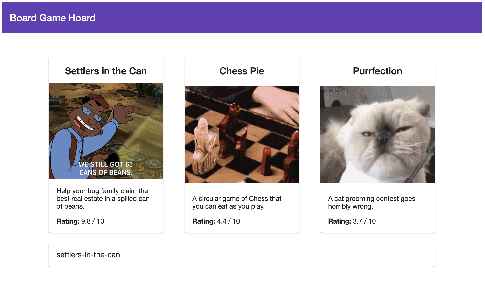
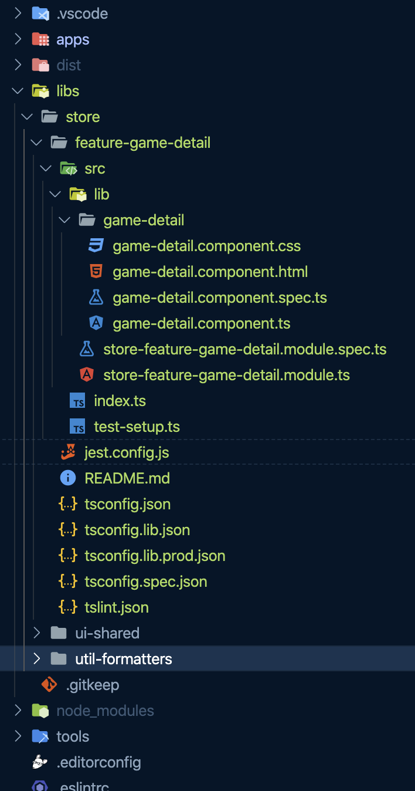

### 💻 Lab 6 - Generate a route lib

###### ⏰ Estimated time: 15-25 minutes

We'll look at more advanced usages of the `@nrwl/angular` schematics and generate a new route lib for our store application. We'll see how Nx takes care of most of the work, and we just have to do the wiring up!

#### 📚 Learning outcomes:

- Get familiar with more advanced usages of Nx generate schematics to create an Angular route lib

#### 📲 After this workshop, you should have:

<details>
  <summary>App Screenshot</summary>
  
</details>

<details>
  <summary>File structure</summary>
  
</details>

#### 🏋️‍♀️ Steps:

1. Stop `nx serve`
2. Use the `@nrwl/angular:lib` schematic to generate a new routing library called `feature-game-detail` that:

   - lives under `libs/store`
   - has lazy loading
   - has routing enabled
   - its parent routing module is `apps/store/src/app/app.module.ts`

   ⚠️ **Use `--help`** with the above schematic to figure out which options you need to use to enable **all** the above (See the solution if still unsure)

3. Generate a new Angular component called `game-detail` under the above lib you created

4. Change the routing path in `apps/store/src/app/app.module.ts` to pick up the game ID from the URL

   <details>
   <summary>🐳 Hint</summary>

   ```ts
   {
   path: 'game/:id', // <---- HERE
   loadChildren: () =>
       import('@bg-hoard/store/feature-game-detail').then(/* ... */)
   }
   ```

    </details>

5. Uncomment _line 11_ in `libs/store/feature-game-detail/src/lib/store-feature-game-detail.module.ts` and make sure it's pointing to the `game-detail` component you generated above

   <details>
   <summary>🐳 Hint</summary>

   ```ts
   RouterModule.forChild([
     { path: '', pathMatch: 'full', component: GameDetailComponent }
   ]);
   ```

    </details>

6. Import `MatCardModule` in `store-feature-game-detail.module.ts` and add it to the module's `imports: [...]`:


    <details>
    <summary>🐳 Hint</summary>

    ```ts
    import { MatCardModule } from '@angular/material/card';
    ```

     </details>

7. Populate your new component with the provided files: `game-detail.component.`[ts](../../examples/lab6/libs/store/feature-game-detail/src/lib/game-detail/game-detail.component.ts) / [css](../../examples/lab6/libs/store/feature-game-detail/src/lib/game-detail/game-detail.component.css) / [html](../../examples/lab6/libs/store/feature-game-detail/src/lib/game-detail/game-detail.component.html)

8. We now need to display your new routed component. Let's add a `<router-outlet>` below our list of cards:


    <details>
    <summary>🐳 Hint</summary>

    `apps/store/src/app/app.component.html`:

    ```html
    <div class="container">
        <div class="games-layout">
            <mat-card class="game-card" *ngFor="let game of games">
            ...
            </mat-card>
        </div>
        <router-outlet></router-outlet> <--- ADD IT HERE
    </div>
    ```

     </details>

9. Make clicking on each card route to the `feature-game-detail` module with the game's ID:


    <details>
    <summary>🐳 Hint</summary>

    ```html
    <div class="container">
        <div class="games-layout">
            <mat-card class="game-card"
                    *ngFor="let game of games"
                    [routerLink]="['/game', game.id]"> <--- HERE
            ...
            </mat-card>
        </div>
        <router-outlet></router-outlet>
    </div>
    ```

     </details>

10. Serve your app again, click on some games, and compare with the screenshot above
11. Launch the dependency graph and see what's been added
12. Inspect what changed from the last time you committed, then commit your changes

---

The result is still pretty simple though. Our route just displays the ID of the selected game in a card. It would be great if we had some API to get the full game from that ID!

---

🎓If you get stuck, check out [the solution](SOLUTION.md)

---

[➡️ Next lab ➡️](../lab7/LAB.md)
