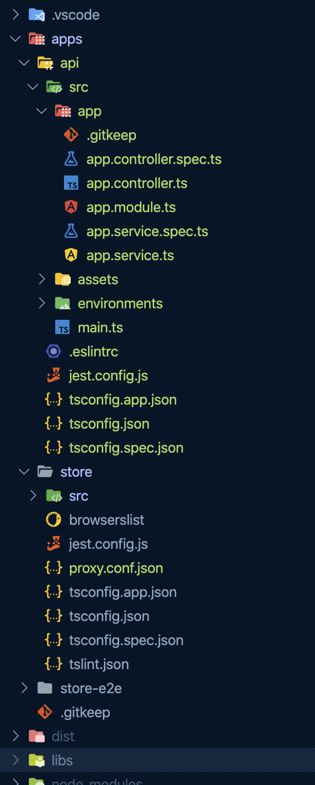

### 💻 Lab 7 - Add a NestJS API

###### ⏰ Estimated time: 10-15 minutes

Up until now we've had a single app in our repository, and a few other libs that it uses.

But remember how we created that `fake-api` way back in the second lab, that only our `store` app can access?

Our new routed component suddenly needs access to the games as well, so in this lab we'll be adding a completely new app, this time on the backend, as an API. And we'll use the `@nrwl/nest` package to easily generate everything we need.

You do not need to be familiar with Nest (and you can use the `@nrwl/express:app` plugin instead if you wish). All the NestJS specific code for serving the games is provided in the solution.

#### 📚 Learning outcomes:

- Explore other plugins in the Nx ecosystem

#### 📲 After this workshop, you should have:

  
App Screenshot

  No change in how the app looks!

  
File structure

  

#### 🏋️‍♀️ Steps:

1. Stop any running `nx serve` instance
2. `yarn add @nrwl/nest`
3. Generate a new NestJS app, called `api`

   ⚠️ Make sure you instruct the schematic to configure a proxy from the frontend `store` to the new `api` service (use `--help` to see the available options)

4. If asked about what directory to create it in, just leave blank and press `ENTER`
5. Copy the code from the `fake api` to the new Nest `apps/api/src/app/`[app.service.ts](../../examples/lab7/apps/api/src/app/app.service.ts) and expose the `getGames()` and `getGame()` methods

6. Update the Nest [app.controller.ts](../../examples/lab7/apps/api/src/app/app.controller.ts) to use the new methods from the service

7. Let's now inspect the dependency graph!
8. Inspect what changed from the last time you committed, then commit your changes

---

🎓If you get stuck, check out [the solution](SOLUTION.md)

---

[➡️ Next lab ➡️](../lab8/LAB.md)
