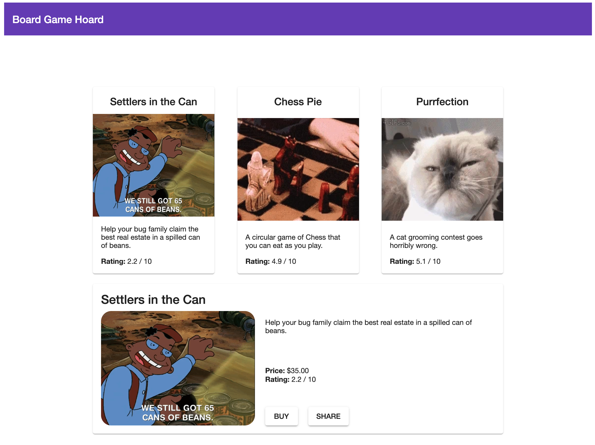

### 💻 Lab 8 - Displaying a full game in the routed game-detail component

###### ⏰ Estimated time: 15-20 minutes

Now that we have a proper API, we can remove the `fake-api` created earlier and make proper HTTP requests. We'll also look at how the Nrwl NestJS schematics created a helpful proxy configuration for us.

#### 📚 Learning outcomes:

- Learn how to connect frontend and backend apps in an Nx workspace

#### 📲 After this workshop, you should have:

<details>
  <summary>App screenshot</summary>
  
</details>

#### 🏋️‍♀️ Steps:

1. We can now delete the `fake-api` from the `store` app
2. Import the `HttpClientModule` in `apps/store/src/app.module.ts` and add it to the module's imports array:

   <details>
   <summary>🐳 Hint</summary>

   ```ts
   import { HttpClientModule } from '@angular/common/http';
   ```

   </details>

3. Within the same folder, inject the `HttpClient` in the [app.component.ts](../../examples/lab8/apps/store/src/app/app.component.ts)'s constructor and call your new API as an _HTTP request_

   ⚠️ _Notice how we assume it will be available at `/api` (more on that below)_

4. Because our list of `games` is now an Observable, we need to add an `async` pipe in the template that gets the games:

   <details>
   <summary>🐳 Hint</summary>

   ```html
   <mat-card
     class="game-card"
     *ngFor="let game of games | async"
     [routerLink]="['/game', game.id]"
     >...</mat-card
   >
   ```

   </details>

5. Run `nx serve api`

   ⚠️ Notice the _PORT_ number

6. In a different tab, run `nx serve store`

   ⚠️ Again, notice the _PORT_ number

7. Everything should still look/function the same!

---

🎓 Even though the frontend and server are being exposed at different ports, we can call `/api` from the frontend store because `Nx` created a proxy configuration for us (see `apps/store/proxy.conf.json`) so any calls to `/api` are being routed to the correct address/port where the API is running.

---

Now let's load the full game in our routed component!

8. Inside the `libs/store/feature-game-detail/src/lib` folder, replace the following files:

   - `/game-detail/game-detail.component.` [ts](../../examples/lab8/libs/store/feature-game-detail/src/lib/game-detail/game-detail.component.ts) / [html](../../examples/lab8/libs/store/feature-game-detail/src/lib/game-detail/game-detail.component.html)
   - [/store-feature-game-detail.module.ts](../../examples/lab8/libs/store/feature-game-detail/src/lib/store-feature-game-detail.module.ts)

   ⚠️ Notice how we're using the shared `formatRating()` function in our routed component as well!

9. Your component should look similar to the the provided screenshot!
10. Inspect what changed from the last time you committed, then commit your changes

---

🎓If you get stuck, check out [the solution](SOLUTION.md)

---

[➡️ Next lab ➡️](../lab9/LAB.md)
